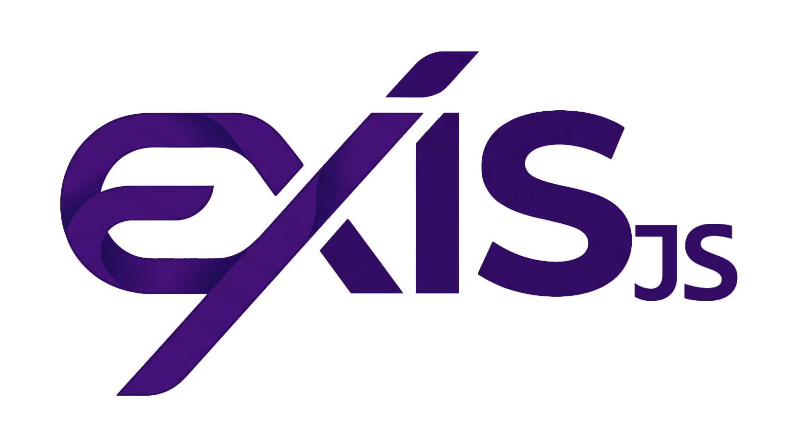

<p align="center">
  
  <h1 align="center">Exis JS</h1>
</p>

<p align="center">
  <b>Enterprise ambition with zero-config simplicity. The ultimate batteries-included Node.js backend.</b>
</p>

<p align="center">
  <a aria-label="NPM version" href="https://www.npmjs.com/package/exisjs">
    
  </a>
  <a aria-label="License" href="https://github.com/v25group/exisjs/blob/main/LICENSE">
    
  </a>
  <a aria-label="Join the community on GitHub" href="https://github.com/v25group/exisjs/discussions">
    
  </a>
</p>

---

## ⚡ What is ExisJS?

**Stop wiring together routers, validation schemas, and Swagger docs.**
ExisJS is the ultimate Node.js backend framework that combines the zero-config brilliance of Next.js file-system routing with the enterprise-grade structure of NestJS—all powered by a wildly fast, zero-allocation radix HTTP engine.

If you love the simplicity of Express but need the production-readiness of TypeScript, Dependency Injection, automatic OpenAPI documentation, and End-to-End type safety out of the box... you are in the right place.

---

## 🚀 The 60-Second Quickstart

Start a fully-configured, production-ready backend in under a minute:

```bash
npm create @exisjs@latest my-backend
cd my-backend
npm run dev
```

### Show, Don't Tell: Your First Controller

ExisJS doesn't force you into a single paradigm. You can build lightweight functional routes (Hono-style) or enterprise OOP controllers (NestJS-style) both feature automatic validation and Swagger OpenAPI generation out of the box!

<details open>
<summary><b>Option A: Functional Routing</b></summary>

```typescript
import { controller, route } from 'exisjs/router'
import { v } from 'exisjs/validator'

const UserSchema = v.object({ id: v.number(), name: v.string() })

export default controller({
  // Safely typed, automatically validated, and added to Swagger!
  createUser: route.post('/', {
    body: UserSchema,
    returns: UserSchema,
    handle: async ({ body }) => {
      return { id: Date.now(), name: body.name }
    },
  }),
})
```

</details>

<details>
<summary><b>Option B: Class-Based (OOP) Controllers</b></summary>

```typescript
import { Controller, Post, Body, Returns } from 'exisjs/decorators'
import { v } from 'exisjs/validator'

const UserSchema = v.object({ id: v.number(), name: v.string() })

@Controller()
export default class UserController {
  @Post('/')
  @Returns(UserSchema)
  async createUser(@Body() body: typeof UserSchema) {
    // 1. Automatically validated against UserSchema
    // 2. Safely typed as { id: number, name: string }
    // 3. Automatically mapped into your Swagger /docs/json!
    return { id: Date.now(), name: body.name }
  }
}
```

</details>

---

## 🛠️ Why ExisJS? (The Problem We Solve)

The Node.js ecosystem is incredibly fragmented.

- **Express / Fastify** are blazing fast, but require you to manually install and configure routers, validation libraries (Zod), DI containers, and OpenAPI generators.
- **NestJS** provides enterprise structure, but comes with a massive learning curve, heavy boilerplates, and slow cold-starts.

**ExisJS bridges the gap.**

1. **File-System Routing**: Drop a `route.ts` file in `src/http/users/` and you instantly have a `/users` endpoint.
2. **Auto-Generated Swagger**: Every `@Body`, `@Query`, and `@Returns` decorator automatically builds your interactive OpenAPI docs. No duplicate JSON schemas required.
3. **End-to-End Type Safety**: Our `@exisjs/client` package gives your React/Vite frontend magical auto-completion of your backend routes and payloads without importing any Node.js code.
4. **Blazing Fast**: Built on a zero-allocation Radix Tree, ExisJS routing scales effortlessly to thousands of endpoints with zero degradation in P99 latency.

---

## 📁 What's in the Box? (CLI Structure)

When you run `npx @exisjs/create`, here is the beautiful architecture generated for you:

```text
my-backend/
├── src/
│   ├── http/
│   │   ├── health/
│   │   │   └── route.ts       # A fully functioning /health endpoint
│   │   ├── route.ts           # The root / endpoint
│   │   └── server.ts          # Global server lifecycle & plugins
│   ├── env.ts                 # Type-safe environment variables (Zod)
│   └── exis.config.ts         # Centralized configuration (CORS, Logger, etc)
├── package.json
└── tsconfig.json
```

---

## 🧪 Sample Applications

Nobody trusts an unproven framework. That's why we've built full-scale examples directly in our repository so you can see ExisJS in action:

- [**01-my-app**](./examples/01-my-app): A perfect minimal starter app showing File-System Routing.
- [**02-bookstore**](./examples/02-bookstore): A full-stack E-Commerce API showcasing nested routes, error boundaries, and DI.
- [**03-chat**](./examples/03-chat): Real-time communication using ExisJS built-in WebSockets.
- [**04-ai-chat**](./examples/04-ai-chat): Streaming responses and integration examples.
- [**05-all-features**](./examples/05-all-features): The kitchen sink—Cron Jobs, Queues, Database adapters, and more!

---

## 🏗️ Architecture (Monorepo)

The Exis JS framework is meticulously organized as a monorepo containing three purpose-built packages:

1. 📦 **`exisjs`** - The core backend engine. It handles high-performance HTTP routing, WebSockets, background tasks, and Swagger.
2. 📦 **`@exisjs/client`** - The 0-dependency frontend proxy client. Connect your React app to your API with full types.
3. 📦 **`@exisjs/create`** - The interactive CLI tool to instantly scaffold production-ready Exis JS projects.

---

## 🤝 Contributing & Community

ExisJS is currently in **Beta**! We are actively looking for developers to break things, build things, and tell us what features are missing.

Please make sure to read the [Contribution Guidelines](./CONTRIBUTING.md) before opening an issue. We curate a list of **Good First Issues** specifically designed for developers looking to make their first impact.

<p align="center">
  <i>Engineered with absolute precision by the Exis JS Team.</i>
</p>
